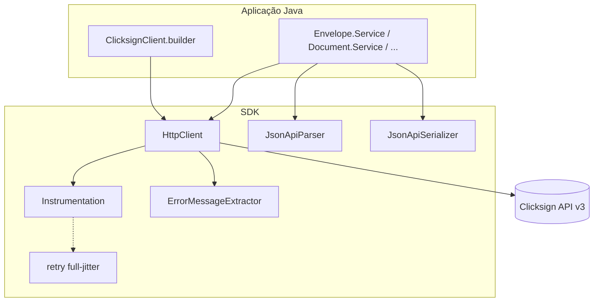
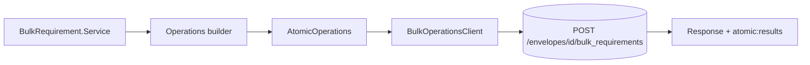
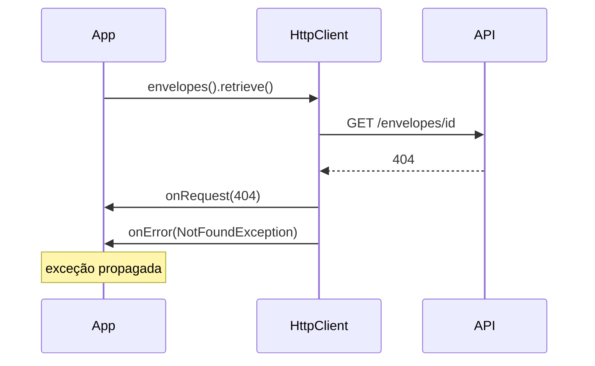

# Arquitetura do SDK

Visão das camadas internas do Clicksign Java SDK e como uma chamada percorre o código até a API v3.

## Fluxo HTTP padrão

### Camadas

| Camada | Responsabilidade |
|--------|------------------|
| `ClicksignClient` | Ponto de entrada; expõe `Service` por resource |
| `*.Service` | CRUD e ações de domínio; monta path e body |
| `HttpClient` | `java.net.http.HttpClient`, headers JSON:API, retry, exceções |
| `JsonApiSerializer` | Request bodies `data.type` + `attributes` + `relationships` |
| `JsonApiParser` | Response → `ResourceObject` → classes de domínio |
| `MinimalJsonParser` | Parser JSON recursive-descent (zero dependências) |

## Operações em massa (bulk)

`BulkOperationsClient` difere do `HttpClient` principal:

| Comportamento | `HttpClient` | `BulkOperationsClient` |
|---------------|--------------|------------------------|
| Retry em 5xx / 429 | Sim (se `maxRetries > 0`) | Não |
| Retry em timeout | Sim | Sim |
| Corpo em 4xx/5xx com `atomic:results` | Lança exceção | Retorna corpo para parse parcial |

Motivo: operações atômicas podem falhar parcialmente por slot; reenviar o lote inteiro após 500 pode duplicar requisitos já criados.

## Instrumentação no fluxo HTTP

## Retry (HTTP principal)

Com `maxRetries > 0`:

1. Calcula teto: `ceiling = min(0.5 × 2^(attempt−1), 30)` segundos  
2. Espera aleatória uniforme em `[0, ceiling)` (full jitter), **ou** espera `Retry-After` em 429/503 quando o header vier preenchido  
3. Publica `onRetry` e repete em `RateLimitException`, `ServerException`, `ServiceUnavailableException`, `TimeoutException`

## Cliente HTTP e thread safety

- Uma instância de `java.net.http.HttpClient` por `ClicksignClient` (criada no construtor de `HttpClient` / `BulkOperationsClient`)
- Sem connection pool configurável na API pública — a JVM reutiliza conexões internamente
- `ClicksignClient` é imutável após `build()` e seguro para uso concorrente entre threads (desde que params/builders não sejam compartilhados mutáveis)

## O que não está no SDK

| Recurso | Status |
|---------|--------|
| Cliente assíncrono | Não implementado — use threads ou `CompletableFuture` na aplicação |
| Envio de header `X-Request-Id` customizado | Não exposto no builder — use `requestId()` da resposta de erro para correlação com suporte |
| Gson / Jackson | Não usados — parser próprio |

## Referências

- [SDK_CONTRACT.md](SDK_CONTRACT.md) — contrato multi-SDK  
- [OBSERVABILITY.md](OBSERVABILITY.md) — hooks de diagnóstico  
